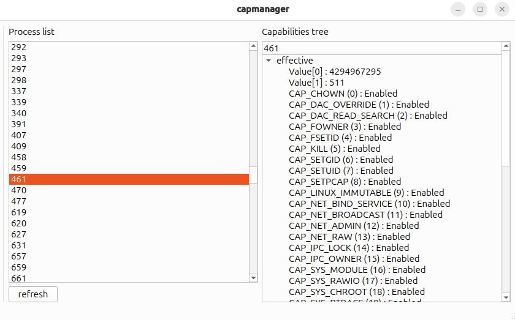
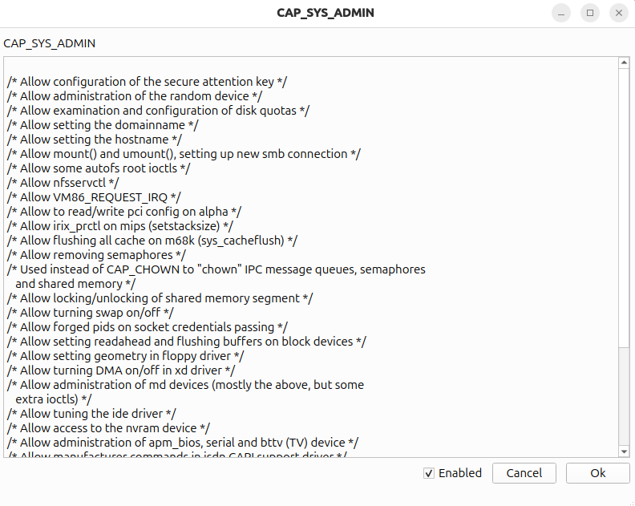
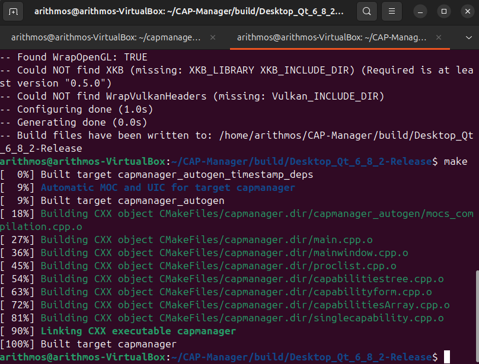

# CAP-Manager
[](https://sonarcloud.io/summary/new_code?id=Arithmos-_CAP-Manager)
[](https://sonarcloud.io/summary/new_code?id=Arithmos-tools_CAP-Manager)
[](https://sonarcloud.io/summary/new_code?id=Arithmos-tools_CAP-Manager)
[](https://sonarcloud.io/summary/new_code?id=Arithmos-tools_CAP-Manager)




以下は、オペレーティングシステム上で動作する各プロセスの一覧を表示し、それぞれの「capabilities」（権限）を表示するプログラムです。さらに、effective、permitted、inheritable の3種類のcapabilitiesも表示します。また、他のプログラムのcapabilitiesを変更することも可能ですが、この操作はリスクを伴い、カーネルの再コンパイルが必要になる場合があります（VFS capability supportを無効にし、cap_setpcap capabilityがeffectiveになっている必要があります）。

cap_setpcapをeffectiveにする方法は、スーパーユーザー権限で以下のコマンドを実行することです：

```setcap cap_setpcap=pie ./capmanager```

使用されるシステムコールは capget と capset であり、これら2つの呼び出しによってcapabilitiesを変更することができます。capabilitiesは、32ビット整数6個のビット列として表現され、__user_cap_data_struct 構造体を通じて取得することが可能です。


## コンパイルする方法

QtをインストールしてからBuildというフォルダーでは以下のコマンドを書いてください。
CMAKE_PREFIX_PATHを設定してください、私の場合なら/opt/Qt/6.8.2/gcc_64/lib/cmake/Qt6になります。

```
cmake ../.. -DCMAKE_PREFIX_PATH=/opt/Qt/6.8.2/gcc_64/lib/cmake/Qt6
make
```


